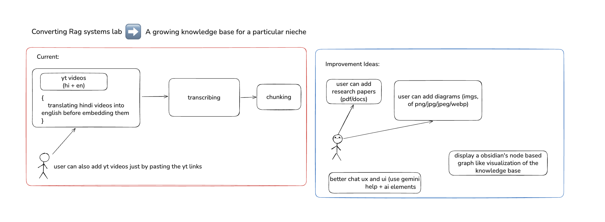

# Rag-Knowledge-base - Methodology
        



## Source Material

The dataset for this project consisted of four YouTube videos provided in the assignment, covering machine learning, neural networks, and transformers. Two videos were in English and two in Hindi.

1. **3Blue1Brown — *But what is a Neural Network?***
   [https://youtube.com/watch?v=aircAruvnKk](https://youtube.com/watch?v=aircAruvnKk)

2. **3Blue1Brown — *Transformers, the tech behind LLMs***
   [https://youtube.com/watch?v=wjZofJX0v4M](https://youtube.com/watch?v=wjZofJX0v4M)

3. **CampusX — *What is Deep Learning?* (Hindi)**
   [https://youtube.com/watch?v=fHF22Wxuyw4](https://youtube.com/watch?v=fHF22Wxuyw4)

4. **CodeWithHarry — *All About Machine Learning & Deep Learning* (Hindi)**
   [https://youtube.com/watch?v=C6YtPJxNULA](https://youtube.com/watch?v=C6YtPJxNULA)

These videos were selected because they explain core machine learning concepts in detail and contain clear educational explanations suitable for building a retrieval-based QA system.

---

## Transcript Extraction

Transcripts were obtained using the **youtube-transcript-api**.

For the English videos, transcript retrieval was straightforward. However, the Hindi videos required additional processing because the transcripts were provided in **pure Hindi Devanagari script**.

To standardize the dataset, the Hindi transcripts were translated into English. Initially, a smaller translation model (`Helsinki-NLP/opus-mt-hi-en`) was tested locally, but the translations were often inaccurate and contained phonetic approximations or garbled outputs.

Therefore, the translation pipeline was replaced with **Google Deep Translate**, which produced significantly more reliable English translations.

### Why Translation Was Necessary

While it would have been possible to embed the Hindi transcripts directly, doing so would introduce a **cross-language retrieval problem**. Most user queries are expected to be in English, and embedding English queries against Hindi text embeddings can reduce semantic similarity performance.

To avoid this mismatch and improve retrieval quality, all transcripts were converted into **English before embedding**, ensuring that both stored documents and user queries exist in the same semantic space.

---

## Chunking Strategy

The transcripts were segmented into smaller chunks before being embedded and stored in the vector database.

This step was necessary because the videos ranged from approximately **15 minutes to 1 hour**, producing very large transcripts. Embedding an entire transcript at once would be inefficient and memory-intensive.

A chunking function was implemented that splits the transcripts based on **word count**, with a chunk size of **approximately 200 words**, which provided a good balance between:

* semantic coherence
* embedding efficiency
* retrieval precision

Each chunk was then individually embedded and inserted into the vector database.

---

## Embedding Model

The embedding model used was:

**all-MiniLM-L6-v2**

This is a lightweight **Sentence Transformer model** that provides strong performance for semantic similarity tasks while remaining computationally efficient.

Each transcript chunk was converted into a vector embedding using this model before being stored in the vector database.

---

## Vector Database

The vector database used in this project was **Qdrant**.

All transcript embeddings were stored in a collection named:

`yt-transcripts`

Each stored vector included a detailed payload containing metadata associated with the transcript segment.

### Payload Structure

```
{
  "payload": {
    "text": chunk["text"],
    "start_time": chunk["start_time"],
    "end_time": chunk["end_time"],
    "video_id": video_id,
    "source": source,
    "original_lang": original_lang,
    "is_translated": is_translated
  }
}
```

Each record also included:

* the **vector embedding**
* a **unique UUID identifier**

This metadata allowed the system to trace answers back to specific videos and timestamps.

---

## Retrieval Process

When a user submits a query:

1. The query text is first converted into an embedding using the same embedding model (`all-MiniLM-L6-v2`).
2. The embedding is used to search the **Qdrant vector database**.
3. The system retrieves the **Top-K most similar transcript chunks** based on cosine similarity.

These retrieved chunks serve as the **context for the language model**.

---

## Language Model for Answer Generation

For generating final responses, the system uses:

**Gemini 2.5 Flash**

The retrieved transcript chunks are provided to the model as context, allowing it to produce a **grounded answer based on the source material**.

This approach ensures that answers are derived from the retrieved content rather than from general model knowledge.

### Some Chats with the bot
 
 
 

---

## API Layer

The backend is implemented using **FastAPI**.

A single primary endpoint handles queries:

`POST /api/query`

The request body accepts JSON input:

```
{
  "user_query": "..."
}
```

The endpoint performs:

1. Query embedding
2. Vector search in Qdrant
3. Context retrieval
4. LLM answer generation
5. Response formatting with source references

---

## Frontend Interface

The frontend is implemented using **Next.js with shadcn/ui components**.

The interface consists of a simple chat-style screen where:

* Users submit questions
* The RAG assistant generates answers
* Responses include **source citations with timestamps**
* Relevant **YouTube video cards** are displayed below the answer for verification

This allows users to quickly navigate to the exact portion of the source video used to generate the response.


---

## Self-Hosting Rag-Pipeline

You can run the entire backend and Redis stack locally using Docker Compose. No external setup is required — just clone the repo and run a single command.

### 1. Fork and Clone the project

```bash
git clone https://github.com/your-username/rag-systems-lab
cd apps/rag-pipeline
```

### 2. Set up environment variables

Copy the example environment file and edit if necessary:

```bash
cp .env.example .env
```

The `.env` file should include:

```env
PORT=8000
REDIS_HOST=redis
REDIS_PORT=6379
```

> `REDIS_HOST=redis` refers to the Redis service inside Docker Compose.

---

### 3. Run with Docker Compose

```bash
docker compose up --build
```

* The API will be available at `http://localhost:8000`
* Redis runs automatically inside Docker
* No manual installation needed

---

### 4. Access API

Test the query endpoint:

```bash
curl -X POST http://localhost:8000/api/query \
     -H "Content-Type: application/json" \
     -d '{"user_query": "What is a neural network?"}'
```

You should receive a response generated by the RAG pipeline using the embedded YouTube transcripts.

---

### 5. Stopping the stack

```bash
docker compose down
```

This stops both the API and Redis containers and cleans up the network.

---

This ensures that anyone can **self-host your RAG backend** with minimal setup.

